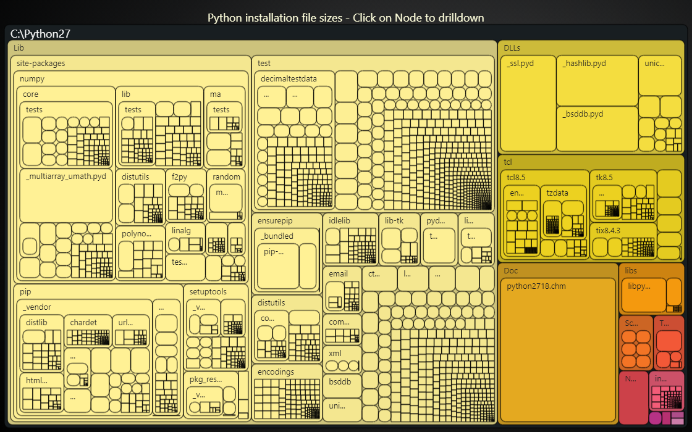

# TreeMapChart drill down



This demo application belongs to the set of examples for LightningChart JS, data visualization library for JavaScript.

LightningChart JS is entirely GPU accelerated and performance optimized charting library for presenting massive amounts of data. It offers an easy way of creating sophisticated and interactive charts and adding them to your website or web application.

The demo can be used as an example or a seed project. Local execution requires the following steps:

-   Make sure that relevant version of [Node.js](https://nodejs.org/en/download/) is installed
-   Open the project folder in a terminal:

          npm install              # fetches dependencies
          npm start                # builds an application and starts the development server

-   The application is available at _http://localhost:8080_ in your browser, webpack-dev-server provides hot reload functionality.


## Description

The TreeMap chart enables users to navigate through layers of data, uncovering details.
This feature ensures that users can easily track their position within the data hierarchy and navigate back to broader overviews without losing context, with the help of navigation paths at the top of the chart.

Additionally, you can disable the drill-down feature or limit the number of visible node levels:

```js
// Show only 1 level of child nodes
chart.setDisplayedLevelsCount(1)

// Disable drill-down interaction
chart.setDrillDownEnabled(false)
```


## API Links

* [Treemap Chart]


## Support

If you notice an error in the example code, please open an issue on [GitHub][0] repository of the entire example.

Official [API documentation][1] can be found on [LightningChart][2] website.

If the docs and other materials do not solve your problem as well as implementation help is needed, ask on [StackOverflow][3] (tagged lightningchart).

If you think you found a bug in the LightningChart JavaScript library, please contact sales@lightningchart.com.

Direct developer email support can be purchased through a [Support Plan][4] or by contacting sales@lightningchart.com.

[0]: https://github.com/Arction/
[1]: https://lightningchart.com/lightningchart-js-api-documentation/
[2]: https://lightningchart.com
[3]: https://stackoverflow.com/questions/tagged/lightningchart
[4]: https://lightningchart.com/support-services/

© LightningChart Ltd 2009-2022. All rights reserved.


[Treemap Chart]: https://lightningchart.com/js-charts/api-documentation/v5.2.0/classes/TreemapChart.html

